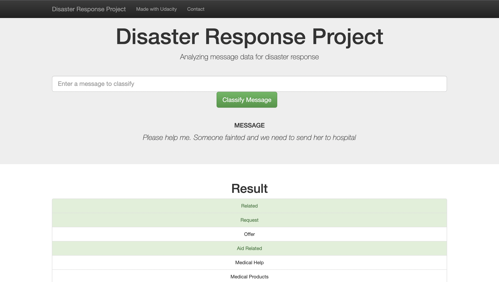
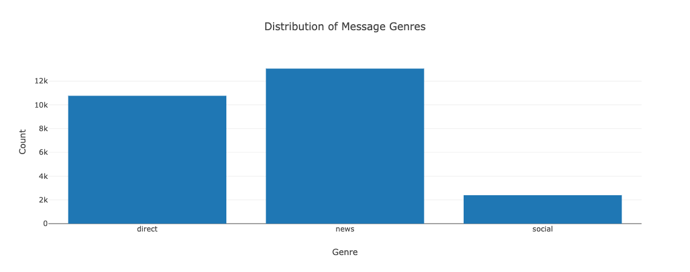
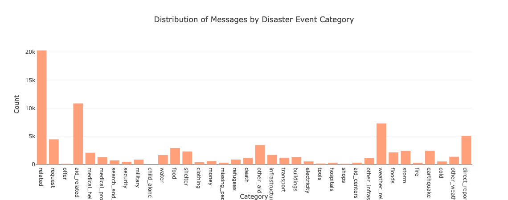
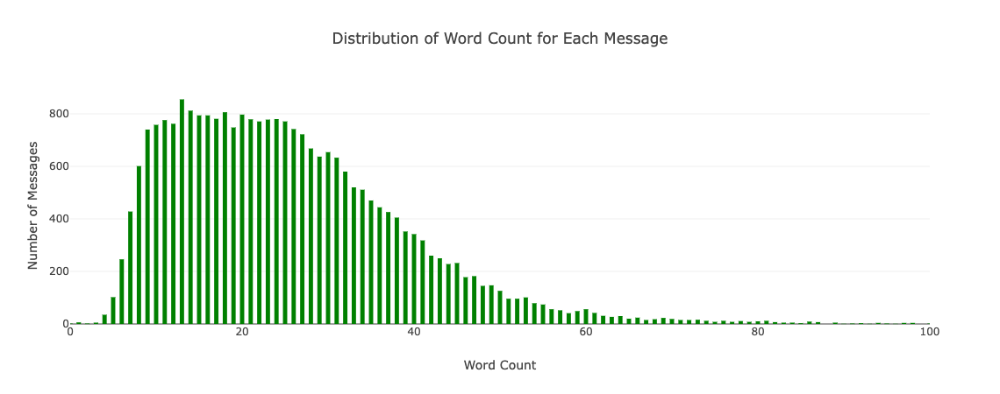

# Project 2 - Disaster Response
## Udacity Nanodegree Data Scientist - Project 2 analyse disaster messages by categories for disaster response

## Table of Contents
- Installation
- Project Motivation
- File Descriptions
- Project Components
- Instructions
- Licensing, Authors, Acknowledgements

## Installation
There should be no necessary libraries to run the code here beyond the Anaconda distribution of Python. The code should run with no issues using Python versions 3.*.

The list of python packages required:

* numpy
* pandas
* nltk
* time
* pickle
* sqlalchemy
* sklearn
  

## Project Motivation
In this project, I applied data engineering skills that I had learned earlier to analyze disaster data from Appen (formally Figure 8) to build a model for an API that classifies real messages that were sent during disaster events. I created a machine learning pipeline to categorize disaster events so that I can send the messages to an appropriate disaster relief agency. The project includes a web app where an emergency worker can input a new message and get classification results in several categories. The web app will also display visualizations of the data. 


## File Description
```bash
- app
| - template
| |- master.html  # main page of web app
| |- go.html  # classification result page of web app
|- run.py  # Flask file that runs app

- data
|- disaster_categories.csv  # data to process
|- disaster_messages.csv  # data to process
|- process_data.py
|- DisasterResponse.db   # database to save clean data to

- models
|- train_classifier.py
|- classifier.pkl  # saved model

- img
|- screenshot.png # screenshot of the web app

- README.md # this file
```

## Project Components
Project Components
There are three components you'll need to complete for this project.

1. ETL Pipeline
A Python script, process_data.py, write a data cleaning pipeline that:
- Loads the messages and categories datasets
- Merges the two datasets
- Cleans the data
- Stores it in a SQLite database

2. ML Pipeline
A Python script, train_classifier.py, write a machine learning pipeline that:
- Loads data from the SQLite database
- Splits the dataset into training and test sets
- Builds a text processing and machine learning pipeline
- Trains and tunes a model using GridSearchCV
- Outputs results on the test set
- Exports the final model as a pickle file
  
3. Flask Web App
A flask web app with interactive classification that run the model based on new messages that you enter yourself, and displays visualizations about disaster messages using Plotly.

  







## Instructions
How to Interact with Project:
1. Run the following commands in the project's root directory to set up your database and model.

    - To run ETL pipeline that cleans data and stores in database
        `python data/process_data.py data/disaster_messages.csv data/disaster_categories.csv data/DisasterResponse.db`
    - To run ML pipeline that trains classifier and saves
        `python models/train_classifier.py data/DisasterResponse.db models/classifier.pkl`

2. Run your web app in `app` directory:
     `python run.py`

3. Open the homepage (Go to http://0.0.0.0:3001/)
   
## Licensing, Authors, Acknowledgements
Must give credit to Stack Overflow for the data. You can find the Licensing for the data and other descriptive information at the Kaggle link available here. Otherwise, feel free to use the code here as you would like!
